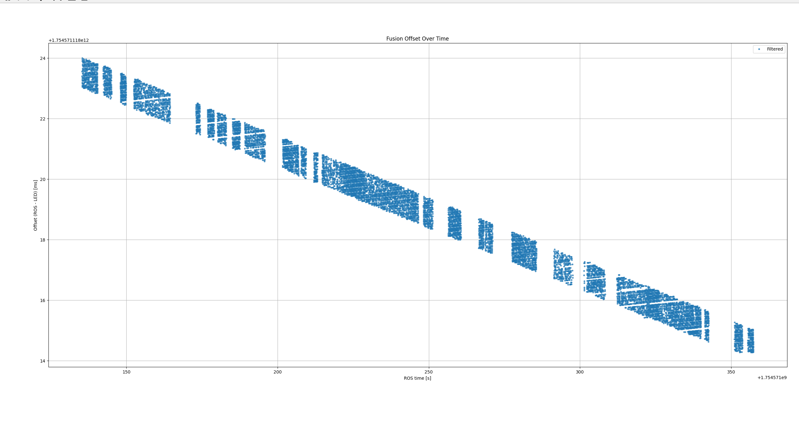

# Checking the Clock Accuracy of the RocSync
## What did we observe? 
During an experiment with Peter Zhang we wanted to check the quality of the timesyncing between two sensors, namely the Atracsys fusionTrack 500 and Luxonis OAK-D Pro W. I had been implementing timesyncing between the datahub clock and the fusiontrack clock using the NICs of the datahubs and the PTP protocol, see relevant file in the documentation.

We used the [RocSync](https://github.com/jaromeyer/RocSync/tree/main) in order to compare the timestamps we got from both cameras. It allows to assign a frame to within 1ms accuracy if the RocSync board is detected on said frame. We noticed an interesting pattern when plotting the timestamps we got from the RocSync compared to the timestamps that "our own timesyncing", namely ROS2/PTP were giving us. The latter should in theory be accurate up to microsecond levels. The pattern can be seen below:

We plot the offset between the RocSync (LED) timestamp and ROS time on the y-axis, and the ROS time on the x-axis. We notice 
1) the offset shifts, and that very consistently, and 
2) the offsets are in a band of 1ms.

We noticed a similar, if less clear, pattern with the OAK camera as well. There it was

## Explanation
- The second point is easily explained: Assuming the timestamps we get from ROS are very accurate (far below 1ms), comparing them to the 1ms-accurate RocSync timestamps means that we get a rounding error of $\pm0.5$ms, explaining the band. And indeed, zooming in on the plot (sadly this is only a screenshot), we see the offset shifting down by a pretty constant amount every frame, and when it reaches the outer edge of the band, it jumps up to the top outer edge again. The areas that are white indicate no detected RocSync board there. 
- The first point on the other hand is more tricky. It indicates that somewhere a clock is wrong, and by quite a lot, somewhere around 4ms per 100s of recording, or 2.4ms/min, which corresponds  to around 40ppm. The clock of the RocSync should be 15ppm accurate according to its specifications. We don't know if one clock is slow and accurate, or if both are compounding their errors, or if they are partially cancelling out.

## Attempts at establishing a reference
- It has proven difficult to establish a ground truth reference. We can read out and record the RocSync clock signal of 1kHz on the Oscilloscope, but the manufacturer does not specify the accuracy of the clock on the oscilloscope itself - we have to realistically assume it could also be in the 5-20ppm range. We measure 1000.045758 Hz, and an error of 45.757 ppm (2.745 ms/min) from a 2min recording. This is another indication that the clock has a higher error than we expect. But again, we do not have a ground truth reference.
- We could order a [DS3231](../media/ds3231.pdf) module, which is able to provide $\pm2$ppm of accuracy, and can output a 1024 Hz signal. It is available for around 5-20 CHF. We could record both the RocSync clock and this signal at the same time, which would finally allow to establish a ground truth reference that is accurate enough for our use case. It would also allow to see whether the clock of the oscilloscope is fast/slow.

## What would the ramifications of an inaccurate clock be
- Jaro Meyer and Lilian Calvet at some point want to order/manufacture more RocSync devices. A ground truth would allow to see whether the error is in the manufacturer range of 15ppm (ask Jaro again to be sure about the numbers). If it is, you could simply order the board with a better clock.
- If the error is much larger, as our experiments so far seem to indicate, something else has to be going wrong in the process. That would then possibly require further investigation before ordering new boards.
- As long as we sync multiple devices to each other with the RocSync as intended, an inaccurate clock should only be a marginal issue. I.e. showing the RocSync to all cameras at the start of the recording and at the end will still synchronize them with each other. You should ideally follow the exact same process at the start and end of the recording, i.e. the same order of cameras and ideally the same movement, so that any marginal errors cancel out. What will still not be accurate in this case will be the absolute time and the FPS. Maybe further thought into this is required, possibly a quick mathematical analysis. Maybe quick meeting with Lilian and/or Jaro to brainstorm about possible issues to decide whether to pursue this whole validation further, i.e. if it could be a problem or not.

## Note
I provide the scripts I used in the `scripts` subfolder. Note that they are not cleaned, but maybe you can use some parts.